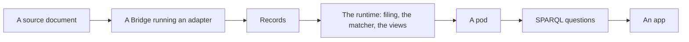

# cascade-runtime-js

## What the Cascade Protocol is

The Cascade Protocol is an open standard for health apps that put patients in
control of their own data.

- **The patient holds the data.** Each person's records are in their own pod, a
  single-tenant RDF graph kept as Turtle files. Apps come to the pod; the pod
  does not go to the apps.
- **Anyone with an idea can build an app.** One command starts an app on a pod,
  and a coding agent can build on it from there.
- **Apps interoperate.** Records arrive from each source format through a Bridge
  running an adapter, so every app reads the same records with the same
  standard SPARQL questions.

It is open source, and built on RDF and Turtle, SPARQL 1.1, SHACL, RO-Crate
and EARL reports.
FHIR R4 is the first source format this runtime files.

Status: a draft. No compatibility is promised before a numbered v1, and no
claim is made that it is fit for clinical use.

## What this repository is

The reference runtime, in TypeScript. It files what arrives into a pod and
answers questions from it, in Node or entirely in a browser, and proves itself
against the vocabulary's executable examples.

## Get going

- [The quick start](https://jayostis.github.io/cascade-runtime-js/start.html)
- [An app running in the browser](https://jayostis.github.io/cascade-runtime-js/try/index.html)
- [The example pods](https://jayostis.github.io/cascade-runtime-js/examples.html)
- [Build from source](#working-on-this-repository)

## The protocol's repositories

| Repository                                                                                   | What it is                                                                                                                                       |
| -------------------------------------------------------------------------------------------- | ------------------------------------------------------------------------------------------------------------------------------------------------ |
| [cascade-vocabulary](https://github.com/jayostis/cascade-vocabulary)                         | The contract a Cascade pod is built and read by: the ontologies and shapes, the standard queries, the runtime rules and the conformance kit.     |
| [cascade-bridge-spec](https://github.com/jayostis/cascade-bridge-spec)                       | The Cascade Bridge Specification: the contract every adapter and every Bridge follows. Draft: no compatibility is promised before a numbered v1. |
| [cascade-bridge-rs](https://github.com/jayostis/cascade-bridge-rs)                           | The Cascade Bridge for Rust, also built for WebAssembly. Draft.                                                                                  |
| [cascade-bridge-js](https://github.com/jayostis/cascade-bridge-js)                           | The Cascade Bridge for JavaScript. Draft.                                                                                                        |
| [cascade-bridge-adapter-fhir-r4](https://github.com/jayostis/cascade-bridge-adapter-fhir-r4) | The adapter for FHIR R4 JSON, alone or in a Bundle. Import-only.                                                                                 |
| [cascade-bridge-adapter-clinvar](https://github.com/jayostis/cascade-bridge-adapter-clinvar) | The adapter for NCBI ClinVar VCV XML. Import-only; the pilot adapter.                                                                            |
| cascade-runtime-js (this repository)                                                         | The reference runtime.                                                                                                                           |

## How it fits together



An adapter is data: mappings, schemas, fixtures and a manifest, with no code. A
Bridge runs it, and there is one Bridge per language.

The core in `packages/runtime/src` knows four interfaces and nothing behind
them. That is how the same runtime runs in Node and in a browser:

| Interface    | What it does                                                            | What plugs in today                             |
| ------------ | ----------------------------------------------------------------------- | ----------------------------------------------- |
| `Files`      | reads and writes bytes, by path or IRI                                  | a local folder, memory, the browser's IndexedDB |
| `Bridge`     | describes and loads an adapter, asks if it accepts a document, converts | cascade-bridge-rs in a worker; saved output     |
| `Store`      | runs SPARQL over named graphs, and reads Turtle as it is written        | Oxigraph's JavaScript build                     |
| `IdsAndTime` | mints the ID of an import or an entry session, and gives the time       | random UUIDs; the clock or the story's times    |

Code that needs Node (a local folder, git, the command line) is under
`packages/runtime/src/node/`. The core knows an importer only by the name
`cascade-runtime.json` gives it; `src/node/importers.ts` finds each by name.
Code that needs a browser (IndexedDB, the Bridge's worker) is under
`packages/runtime/src/web/`, and only the browser entry,
`packages/cascade-runtime/src/browser/`, imports from there.

Conformance is executable. Each rule of the vocabulary is a Gherkin `Rule:`
with the examples that show it, and a runtime reports each example in EARL.

### Packages

| Package                    | What it does                                                   |
| -------------------------- | -------------------------------------------------------------- |
| `packages/runtime`         | files arrivals, names things, runs the matcher and the views   |
| `packages/apple-health`    | the importer: the documents in an export and the facts of each |
| `packages/site`            | the site that documents a pod and its queries                  |
| `packages/graphdb`         | puts a pod and its derived state in GraphDB, and asks it       |
| `packages/cascade-runtime` | what an app imports, and the build that packs it               |

## Working on this repository

The runtime loads the Bridge and the adapters in-process. The vocabulary's
conformance kit is Alex Rivera's story.

Node 22 or later. To build Alex's pod and the site that documents it:

```sh
npm install
npm run build:example alex-rivera        # the pod, then the site
npm run build:example-pod alex-rivera    # generates build/alex-rivera/pod from the story
npm run build:example-site alex-rivera   # generates build/alex-rivera/site from that pod
npm run build:pages                      # every kit's pod and site, under the newcomer's page, in build/pages
```

Open `build/alex-rivera/site/index.html`. The pod is the vocabulary's
`conformance/alex-rivera/` replayed with the Bridge's saved output, so it needs
only Node. The site is built from any pod folder: `--pod <folder>` reads
another, `--out <folder>` writes elsewhere and `--lens <lens>` builds it under
another lens. Every question on the site says how to ask it yourself:

```sh
npm run ask -- <name> "<question>"            # one question's rows, under the runtime's lens
npm run graphdb -- <name> <GraphDB's URL>     # a repository <name>, holding the pod and its questions
```

### Running it

```sh
npm test                                  # the unit tests, and one run of the conformance command
npm run typecheck
npm run lint
npm run conformance -- --report earl.nt   # every example and each kit's checks, as one EARL report
```

`npm run conformance` is for conformance testing only, as the Bridge's command
line is. Its exit code means nothing; the report does. It reads every feature
file of the vocabulary, under `runtime/` and each kit's under `conformance/`,
with Gherkin's own parser, and reports each example, and each kit's four checks
that are not examples (the final views equal `expected/`, every file conforms to
the vocabulary's shapes, every name follows its rule, every file is where the
layout says). Each step of `runtime/steps.md` is implemented once, in
`packages/runtime/src/phrases.ts`; the steps examples share are replayed once,
and a failed example's report names its rule and the step that failed.
`--folder <repository>=<folder>` hands in a folder for a repository, and
`--feature <path>` runs only that feature file of the vocabulary.

### The developer story

`developer-story/allergies.mjs` is what an app would write against the package
`cascade-runtime`: open a pod, look at Alex's first export, import it as hers
and print her active allergies. It is the developer story of
[#20](https://github.com/jayostis/cascade-runtime-js/issues/20) and that epic's
acceptance test. `packages/runtime/test/developer-story.test.ts` runs it and
compares its rows with the replay of her story through `J1`.

### The package

`packages/cascade-runtime` is the package an app installs. It is not on npm:

```sh
npm run build:package    # build/cascade-runtime-0.0.0-commit-<commit>.tgz and build/release-notes.md
```

The tarball holds the package's code, the workspaces under it and the Bridge's
build, bundled, and the vocabulary's and each adapter's files at the head of
each default branch when it ran, which `components/packed.json` records.
Installed, it reads nothing outside its own folder. CI installs it into an empty
folder on Linux, Windows and macOS and runs the developer story there, and every
merge to `main` attaches it to the pre-release `build-<commit>` under
[releases](https://github.com/jayostis/cascade-runtime-js/releases), from which
an app installs it by its URL.

### Which version of each component a run uses

Nothing pins a version, as
[cascade-bridge-spec's `compatibility.md`](https://github.com/jayostis/cascade-bridge-spec/blob/main/compatibility.md)
says. `cascade-runtime.json` names the vocabulary and the adapters by
repository, and names the importers and the lens. For each, first match wins:

1. a sibling checkout, in the folder beside this one named as the repository,
   as it is on disk; the run prints its commit and how many files it has
   uncommitted;
2. a folder handed in with `--folder`, as the compatibility tooling does;
3. otherwise the head of its default branch as it is when the run starts,
   fetched into `build/cache/`; the run prints the branch and the commit.

A worktree looks for each sibling beside itself first, then beside the checkout
it was made from. An adapter is given every file of its folder, and the
vocabulary repository its `bridge:cascadeVocabularyRepository` names, resolved
the same way.

The Bridge is the build cascade-bridge-rs publishes as the release
`build-<commit>` on every push to its default branch: a sibling
`cascade-bridge-rs` checkout's `package/dist`, then that of a checkout handed in
with `--folder`, is used only when it was built from the checkout as it is;
otherwise the newest commit of the default branch with a release, downloaded
into `build/cache/` and checked against the digest the release gives. The run
says which it used, and why a checkout's build was passed over.

Each is named, as `runtime/rules.md` N8 says, by its tree at the commit it is
at, so an EARL report names the same entries on every machine.

CI runs the compatibility check on every pull request and nightly, never on a
push to `main`. `compatibility.json` declares this repository to it as a
runtime: it checks the vocabulary and the adapters out beside this repository,
picked as any counterpart is, and runs `npm run conformance` on them. The tests
and the pod build then read those checkouts. CI publishes Alex's pod and site as
an artifact, and on a push to `main` builds the pages from the head of every
default branch and deploys them.
